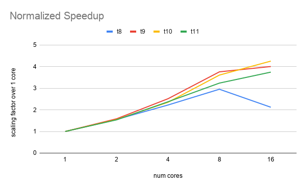

# Checkpoint Report

## ADJUSTED NEW SCHEDULE

### Nov 4 - Nov 16
- [x] Implement software from scratch, Cube representations etc., and benchmarking tools for different implementations;
- [x] Complete basic sequential implementation for resolving cubes in small number of steps;
- [x] Parallelize the basic implementation to adapt to large number of steps;
- [x] Measure all implemented code

### Nov 16 - Nov 23
- [x] Implement the more sophisticated (Iterative Deepening A\* based) algorithms (Korf DB) discussed in the paper.
- [x] Construct IDA with database (Database adapted from [this repo](https://github.com/benbotto/rubiks-cube-cracker/tree/2.2.0))
- [x] Perform measurements for IDA with Korf (only corner) DB over BFS.

### Nov 23 - Nov 30
- [x] Adapt database complete. (We spend some time to port our code and make sure our model works with the given database).
- [x] Parallelize IDA with Korf DB using OMP, and perform measurements.
- [ ] Incorporate different heuristics and branch pruning techniques that we came up with (work in progress, delayed as we were blocked previous on constructing our own DB)

### Nov 30 - Dec 4
- [ ] (tianez) continued improvement of branch pruning techniques and OMP.
- [ ] (chengzhh) MPI implementation of the optimal cube solver. We expect the OMP and MPI algorithms to be different. MPI is more suitable for the more generalized NxNxN cases (which we will not implement due to the changes required for database)

### Dec 4 - Dec 7
- [ ] (team) Measurements over all implemented algorithms and understand the new performance characteristics.

### Dec 7 - Dec 9
- [ ] (team) Slack to also catch up for incomplete work from previous weeks.

### Dec 9 - Dec 14
- [ ] (team) Prepare for poster session and final report.
- [ ] (team) Paper will discuss things for future work directions as well, including, requirements for NxNxN, irregular cubes (applying constraints and heuristics) etc.,.

## REPORT BODY

### Progress

The project began with defining the Cube representation. We opted for six 3x3
array of “COLOR”s, which is the simplest representation we could think of. The
concerns for storing unnecessary COLORS were not addressed directly here, since
we were aware that the Iterative Deepening A\* (IDA) algorithm is a memory
constrained A\* algorithm. Together with this first definition of a Cube struct,
a BFS solver was introduced to understand the amount of memory consumed, and
provide a solution checker for the more complicated algorithms. On GHC machines,
given our [naive BFS implementation](https://github.com/chanzy3/Rubik-s-ParaCube/tree/f4f8db4b0e524edc99e87568abb3f40f0bec50f1),
the BFS solver would be killed when searching at depth 7 of the tree with a
branching factor of 18. (There are 18 transitions for a Rubiks Cube at each
state; although some could be pruned, optimization were no implemented at
this stage)

Next, we implemented the [IDA](https://github.com/chanzy3/Rubik-s-ParaCube/tree/50a990617491d4df74d967765c69ab803b9203af)
Solver. Although not much speed up over the BFS solver was observed. The
new algorithm did alleviate the problem of memory consumption. We were able
to resolve problems with solutions of depth 9 using this solver.

Finally, we bridged our IDA Solver with a database implementaion adapted from
[github](https://github.com/benbotto/rubiks-cube-cracker.git) and created the
IDA with Korf DB ([IDAKDB](https://github.com/chanzy3/Rubik-s-ParaCube/tree/852180af0699f2baa6261dff189d66bb99b52c42))
solver. This solver is also parallelized using OMP and becomes the Parallel
IDAKDB ([ParaIDAKDB](https://github.com/chanzy3/Rubik-s-ParaCube/tree/022add07846d758a25d15c4e007b81baab5a596f))
solver. With the ParaIDAKDB solver and 16 threads, depth 11 case can be solved
in 25s without any search tree branch pruning. (With the initial BFS Solver,
14s is required to solve a depth 6 case.)

### Challenges

#### Efficient Database

To our best understanding, the most unexpected challenge is towards building
the database. We were stuck for a few days. Recall the six 3x3 array of “COLOR”s
representations of the cube, which unsurprisingly is very inefficient as storage
for the Korf DB. We were experimenting with other cube representations; however,
the amount of work to find a good enough representation and correctly generate
a heuristics database was beyond expectation. Therefore, we adapted an efficient
database implementation from [github](https://github.com/benbotto/rubiks-cube-cracker.git).
(Note that only the database reader code and the generated database data files
are used. The repo also contains a sequential solver, which we did not reference.)

We made the decision to adapt the database mainly because we analyzed that the
heuristic bound picking process is a fixed process, i.e. reading generated data
from a database. This process is not interesting from the perspective of
parallelizing the solver. Although we still consider the process of generating
these data challenging, for solving a Rubik's cube case, reading from a piece
of read-only memory does not make parallelization hard. (Dynamic caching is
currently not part of our implementation; it may become relevant when we explore
the pruning techniques. Note that dynamic caching imposes the problem of memory
constraints, which was alleviated by using IDA.)

#### Iterative Search and Synchronization

Although the computation structure of solving a Rubik's Cube is similar to the
Wandering Sales Person tree traversal problem, the search for Rubik's Cube
imposes a few different challenges, most notably:
- huge search space, high branching factor (as proposed before);
- the iterative nature of IDA requires additional synchronization between worker
  threads; this search is not an exhaustive search.
  
We plan to spend a day or two to study the implication towards parallelization
of this iterative nature (besides the obvious synchronization challenges).

### Preliminary Results

The speedups we measured for the ParaIDAKDB solver were (without any pruning):

Each line is for one generated test case: “ti” case is a case where solution
depth is i. So the above diagram shows measurements for test cases with solution
depths from 8 through 11.

Here is a brief analysis:
- The cases with depth 8 and 9 were likely too small for measuring speedups
  when the number of cores is high.
- The speedups were not optimal, which is totally expected, as no pruning 
was used. Currently, we were experimenting with different pruning techniques to
lower the branching factor.
- Note also that, IDA can often perform repeated work; this will happen e.g.
 when no solutions were found with costs equal to a heuristic bound guess.
 The next lowest bound guess will be used and the search will be repeated from
 start. This is a trading extra computation to save memory.
 
### Goals and Deliverables

Although not finished, the process of developing the database inspired many
branch pruning ideas. This is a good side effect that we believe will eventually
help us finish the project on time (together with the slack in the last week
which we intentionally left open for situations like this). This process also
provided insights into solvers for more generalized Rubiks Cubes. These solvers
will not be implemented since they require database changes and regenerating the
data. However, we will attempt to discuss these insights in the final report.

During the poster session, our goal is to perform live demo with scrambles of,
say, 50 steps (whose solution must have reasonable depth) and solve it optimally
according to the move sequence generated by our solver. We will also show graphs
to demonstrate speedups we achieved with different pruning techniques.

#### Change to Old Goals

Due to database challenges, and its uninteresting nature for parallelization, we
propose to switch the old goal of implementing solver for NxNxN cube into the new
goal proposed below. The NxNxN cube solver requires changing database encodings and
regenerating the database for heuristics.

#### Additional New Goals

As an additional goal, we plan to parallelize the solver with MPI (besides OMP).
We expect to have time to implement these two once our experiments with branch
pruning ideas are complete.

### References

- [database implementation source](https://github.com/benbotto/rubiks-cube-cracker.git)
- Solving The Rubik’s Cube with Parallel Processing by Aslesha Nargolkar
- [A Parallel Implementation of Iterative-Deepening-A*](https://www.aaai.org/Papers/AAAI/1987/AAAI87-032.pdf)